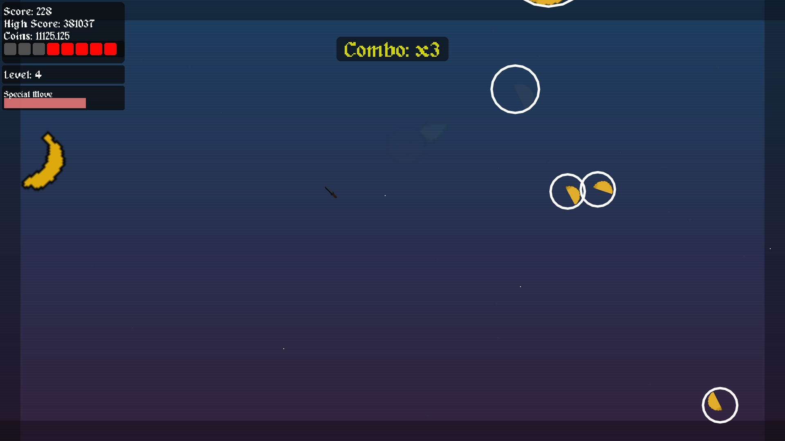

# 🍉 Fruit Cutting

A dynamic fruit‑slicing game built with LÖVE2D. Swipe your blade through flying fruits, chain combos, and survive as the difficulty rises. Unlock achievements, level up your character, and compete for the highest score.


*Picture 1: Game screenshot*

## ✨ Features

- **Multiple Game Modes**  
  - *Classic* – Standard slicing with limited misses.  
  - *Time Attack* – Race against the clock.  
  - *Survival* – Increasingly fast spawns test your reflexes.  
  - *Zen* – No bombs, no penalties – pure slicing.

- **Satisfying Slice Mechanics**  
  - Realistic physics and particle effects.  
  - Combo system – slice multiple fruits quickly to multiply your score.  
  - Fruits split into halves when sliced, with juice particles flying out.

- **Power‑Ups & Bombs**  
  - Collect power‑ups: Double Points, Slow Time, Frenzy, Shield, Extra Life, Screen Clear.  
  - Avoid black bombs – hitting them reduces your score and increases misses.

- **Progression System**  
  - Earn XP and level up, unlocking new content.  
  - Gain fruit coins to spend (future shop planned).  
  - Achievements track slicing milestones, combos, and more.

- **Special Move**  
  - Fill the special meter by slicing fruits.  
  - Press **Space** to clear all fruits, bombs, and active power‑ups from the screen.

- **Visual & Audio Polish**  
  - CRT flicker, screen shake, and animated trail behind your blade.  
  - Dynamic background and level‑up explosions.  
  - Toggle music, SFX, and low‑contrast mode.

- **Save System**  
  - High scores, fruit coins, and achievements are automatically saved.  
  - Progress persists between sessions.

## 🎮 Controls

| Action                | Input               |
|-----------------------|---------------------|
| Slice fruit           | Move mouse          |
| Pause                 | `P`                 |
| In‑game stats menu    | `Tab`               |
| Escape menu           | `Esc`               |
| Special move          | `Space` (when ready)|
| Navigate menus        | Click with mouse    |

## 🚀 How to Run

1. Install [LÖVE2D](https://love2d.org/) (version 11.x or newer).
2. Clone or download this repository.
3. Place the `assets` folder (containing `*.png`, `*.ttf`, and sound files) next to `main.lua`.
4. Run the game with:
   ```bash
   love .
   ```

## 🛠️ Built With

- **LÖVE2D** – Framework for 2D games in Lua.
- **Lua** – Lightweight scripting language.
- Custom sprite, font, and audio assets.

## 📝 Notes

- The game is designed for full‑screen mouse input; cursor is hidden and replaced with a blade sprite.
- Difficulty (Easy, Medium, Hard, Zen) affects fruit speed, spawn rate, and bomb presence.
- Low‑contrast mode reduces visual distractions and flicker.

## 🤝 Contributing

Feel free to fork, add new fruits, power‑ups, or game modes. Pull requests are welcome!